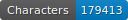
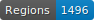
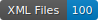

# Dépôt d'entraînement pour des données HTR : la reconnaissance optique de caractères d'un registre manuscrit du XIXe siècle
Ceci est un dépôt de vérité de terrain créée grâce au logiciel eScriptorium. Le document à partir duquel la vérité de terrain a été produite est un registre de la fin XIX`e` siècle. 
Il s'agit d'une étape d'un projet plus important qui consiste à utiliser la reconnaissance optique de caractères manuscrits sur l'ensemble du registre, puis à exporter les données en XML ALTO et à les annoter.


## Le projet
Ce projet est en cours de réalisation (été 2024) dans le cadre d’un CAS (Certificat Advanced Studies) en Humanités numériques à l’Université de Genève sous la direction du Dr Simon Gabay.
Il s'insère dans un projet plus vaste, appelé _Verbier Time Machine_ (VTM), qui vise à
- 1° restituer l’histoire du territoire, du paysage et de la propriété de Val de Bagnes à travers l’utilisation des technologies et des outils numériques;
- 2° à mettre en valeur le patrimoine archéologique, historique et culturel de la commune et
- 3° à encourager la recherche scientifique.

VTM est l’un des projets de l'association _Valais Wallis Time Machine_ [VWTM](https://www.timemachinevs.ch/).
Les données récoltées dans le cadre de ce travail seront agrégées aux autres données du projet VTM.  

## Le registre: description du document
Le document appartient à la commune Val de Bagnes (Valais, Suisse) et est conservé dans ses archives sous la cote AC Bagnes, R 72. Il se présente sous la forme d'un épais registre de papier relié par une couverture cartonnée et se trouve dans un bon état de conservation. Il compte 406 feuillets utilisés recto-verso, paginés de 1 à 800, suivis d’un index alphabétique de 10 feuillets non foliotés. Seules onze pages ont été laissées vides. Les pages se présentent sous la forme de formulaires imprimés remplis par une écriture manuscrite cursive. Une même main a rédigé l'ensemble des pages avec des données de la fin du XIXe siècle. Puis, au fur et à mesure des mutations foncières, des mains postérieures ont ajouté des informations concernant ces changements et biffé des parties du texte afin de les mettre à jour. Le texte rédigé en français comporte par conséquent de nombreuses lignes biffées par trois ou quatre mains différentes. Une soixantaine de feuillets ont subi des dommages mécaniques parfois réparés à l’aide de ruban adhésif. Le volume, sans page de garde, porte ce titre courant « Registre de l’impôt sur les biens-fonds » qui constitue la seule métadonnée de ce registre qui nous soit parvenue.
Ce registre foncier regroupe les biens-fonds des contribuables de l'ancienne commune de Bagnes (Valais, Suisse), domicilié·e·s à Verbier, village de montagne, situé à 1400 m d’altitude. Il n’est pas daté, mais a été ouvert après 1894. Des modifications y ont été apportées jusqu’à la fin des années 1980, mais il a surtout été utilisé dans la première moitié du XXe siècle.

## Description des données

Toutes les pages sont constituées par le même formulaire avec au sommet un titre courant imprimé et un emplacement réservé à la foliotation qui, elle, est manuscrite et s'avère en réalité une pagination. A noter qu'il existe quelques erreurs de pagination (pagination à double, saut de page, etc.). Sous le titre courant, le formulaire comporte un en-tête qui se divise en deux parties. Une partie comprend le nom et le prénom du ou de la contribuable, sa filiation et son lieu de domicile. Elle mélange l'imprimé et le manuscrit. L'autre, exclusivement imprimée, est constituée par les en-têtes des treize colonnes du formulaire qui se présentent ainsi de gauche à droite : le numéro de l’immeuble, le nom local (toponyme), la nature du bien-fonds et les quatre confins, les toises  locales, la contenance en mètres carrés, le montant de la taxe, le capital imposable en francs et en centimes et les mutations.

En août 2022, la commune a fait reproduire numériquement ce registre. Les données RAW ont été converties en JPEG. Les fichiers jpg ont une résolution de 600 ppp


Les colonnes et les lignes du formlaire n'ont pas toujours été respectées par les différentes mains qui sont intervenues sur le manuscrit, ce qui ne facilite ni la segmentation (voir ci-dessous), ni l'OCRisation.

## La technologie
La description de la technologie est tirée du github de [Thibault Maillard] (https://github.com/vtm-topo/impot-batiment)(stagiaire UNIGE en 2022, dans le cadre de ce même projet, toujours sous la direction du Dr Simon Gabay).

### - kraken
Pour effectuer la reconnaissance optique de caractères (OCR ou HTR), nous utilisons le système [kraken](https://kraken.re/main/index.html), un système de deep learning pour HTR (Handwritten Text Recognition).
Kraken permet d'utiliser des modèles pour la reconnaissance de caractères, soit d'apprendre à l'ordinateur comment transcrire les pages en lui donnant beaucoup d'exemples.

### - eScriptorium
Pour créer ces exemples, nous utilisons le logiciel eScriptorium.
eScriptorium permet d'annoter les pages: indiquer quelles lignes il faut transcrire, quelle zone de reconnaissance est générée à partir d'une ligne et comment la transcrire. Il permet également de découper le document en types de zones et de lignes.

### - l'infrastructure de l'Université de Genève
Le Deep Learning nécessite des ressources computationnelles importantes. Il est possible de faire fonctionner kraken sur un simple ordinateur mais pour travailler sur un grand nombre d'images, cela ne suffit pas. Nous utilisons donc l'accès au HPC (super-ordinateur) de l'Université de Genève. L'Université possède trois super-ordinateurs nommés Baobab, Yggdrasil et Bamboo. Nous utilisons Yggdrasil.
Nous utilisons également la version d'eScriptorium hébergée par l'Université, appelée [FoNDUE](https://github.com/FoNDUE-HTR/Documentation).

## Les modèles utilisés
L’OCRisation du document a été faite grâce à l’infrastructure de l’université de Genève et au logiciel eScriptorium Fondue, une application en ligne dont l'accès est réservé.
Le modèle d'OCRisation de base utilisé a été mis au point par Alix Chagué et Thibault Clérice ; il se nomme [HTR-United - Manu McFrench V3 pour Manuscripts of Modern and Contemporaneous French](https://zenodo.org/records/10874058); en automne 2022, ce modèle avait été fine-tuné par Th. Maillard et avait atteint une précision de 94.1%.
Le modèle de segmentation des zones qui a été utilisé se nomme [lectaurep_base](https://github.com/HTR-United/lectaurep-repertoires/). Il a été mis au point par Alix Chagué et son équipe; il avait également été fine-tuné par Th. Maillard et avait atteint une précision de 66.7%.

## La segmentation
### La segmentation des zones
La segmentation suit l'ontologie [SegmOnto](https://segmonto.github.io/).
SegmOnto propose un vocabulaire contrôlé pour décrire le contenu des pages de livres ou de manuscrits, afin d'homogénéiser les données requises par les analyseurs de mise en page. 
Par ailleurs, notre segmentation s'inspire de celle appliquée en 2022 par Th. Maillard à des formulaires de registres fonciers très sembles au registre utilisé dans ce projet.

#### Les zones

Les zones (ou "Region types" selon le vocabulaire d'eScriptorium) identifiées pour segmenter les pages de ce formulaire sont au nombre de six :
- CustomZone:contribuable
- CustomZone:entry\#1
- CustomZone:entry\#2
- NumberingZone:page
- RunningTitleZone
- TableZone:header.


### La segmentation des lignes
La segmentation suit l'ontologie SegmOnto. 

Nous avons identifié 10 types de lignes. Chaque type correspond à un type d'information. Les différentes lignes sont ainsi tagguées:
- CustomLine:Capital
- CustomLine:ClassTaxe
- CustomLine:Contenance
- CustomLine:Nature
- CustomLine:NomLocal
- CustomLine:Numero
- CustomLine:PrixAuMetre
- CustomLine:confins
- CustomLine:mutations
- DefaultLine


## Les principes de transcription
Les principes de transcription qui ont été suivis pendant la génération de la vérité de terrain sont les suivants:
- L’orthographe du document a été respectée. Les éventuelles erreurs n'ont pas été corrigées.
- L'usage des majuscules telles qu'elles apparaissent dans le manuscrit a été respecté, même s'il s'avère faux au regard des règles actuelles.
- Les abréviations sont conservées, c'est-à-dire qu'elles n'ont pas été résolues.
- On utilise un « ^ » pour indiquer que des lettres ou des portions de textes qui suivent le signe sont suscrites.
- Utilisation du double crochet à gauche et à droite de l’expression biffée à l'horizontal (mais pas à la vertical) dans le manuscrit, mais qu’on arrive à lire.
- On inscrit trois xxx minuscules lorsque le texte est illisible.

Nous n'avons pas tenu compte des différentes largeurs d'espace entre les mots ou entre les caractères.

Exemple d'une abréviation conservée


Exemple d'une abréviation suscrite


Exemple d'une majuscule conservée (le v de Volume)


Exemple d'un texte biffé à l'horizontal et transcrit entre double crochets


Exemple d'un texte biffé à la vertical et qui n'est pas transcrit entre double crochets


## Présentation des différents fichiers
Le fichier "htr-united.yml" permet un contrôle continu et automatique de la qualité des données grâce à quatre outils proposés par HTR-United.

Le fichier randomXML permet une répartition aléatoire des fichiers XML en trois sets : un pour l’entraînement (train.txt), un pour l'évaluation (dev.txt) et un dernier pour le test (test.txt). Ces sets sont générés de manière aléatoire pour éviter les biais dus aux changements d’écriture, de formats etc.

Le fichier remove_empy_zone.py supprime les zones vides. Parfois, dans eScriptorium, lors de la segmentation et de la transcription, des zones fantômes sont créées par inadvertance. Extrêmement petites, celles-ci peuvent être impossibles à détecter à l'oeil nu.


## Les Tags d'HTR-united
    

## Licence
Les images ne sont pas publiques; elles sont diponibles sur demande.
Pour les transcriptions [CC-BY]<a rel="license" href="http://creativecommons.org/licenses/by-sa/4.0/"></a><br />This work is licensed under a <a rel="license" href="http://creativecommons.org/licenses/by-sa/4.0/">Creative Commons Attribution 4.0 International Licence</a>.


## Citation
Christine Payot, _Dépôt d'entraînement pour des données HTR : la reconnaissance optique de caractères d'un registre manuscrit du XIXe siècle_, sous la direction de Dr Simon Gabay, Université de Genève, chaire des Humanités numériques, Martigny, janvier 2024.
```bibtex
@misc{PayotHTR2023,
    author="Payot, Christine",
    title="Dépôt entraînement pour données HTR",
    date = "2024",
    url={https://github.com/VTM-Registre-foncier-de-Verbier}    
    
}
```
