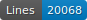

# Dépôt d'entraînement pour des données HTR : la reconnaissance optique de caractères d'un registre manuscrit du XIXe siècle
Ceci est un dépôt de vérité de terrain créée grâce au logiciel eScriptorium. Le document à partir duquel la vérité de terrain a été produite est un registre de la fin XIXe siècle. 
Ce dépôt constitue une étape d'un projet qui consiste à utiliser la reconnaissance optique de caractères manuscrits sur un vaste corpus de textes, puis à exporter les données en xml ALTO et à les annoter en TEI.


## Le projet
Ce projet est en cours de réalisation dans le cadre d’un CAS (Certificat Advanced Studies) en Humanités numériques à l’Université de Genève sous la direction du Dr Simon Gabay.
Il constitue une partie d'un projet plus vaste, appelé _Verbier Time Machine_ (VTM), qui vise à 1° restituer l’histoire du territoire, du paysage et de la propriété de Val de Bagnes à travers l’utilisation des technologies et des outils numériques, 2° à mettre en valeur le patrimoine archéologique, historique et culturel de la commune et 3° à encourager la recherche scientifique. VTM est l’un des projets de l'association _Valais Wallis Time Machine_ [VWTM](https://www.timemachinevs.ch/).
Les données récoltées dans le cadre de ce travail seront agrégées aux autres données du projet VTM.  

## Le registre: description du document
Le document se présente sous la forme d'un épais registre relié. Il compte 406 feuillets utilisés recto-verso, paginés de 1 à 800, suivi d’un index alphabétique de 10 feuillets non foliotés. Seules onze pages ont été laissées vides. Les pages se présentent sous la forme de formulaires imprimés remplis par une écriture manuscrite cursive. Une même main a rempli l'ensemble des pages avec les informations de la fin du XIXe siècle. Puis, au fur et à mesure des mutations foncières, des mains postérieures ont ajouté des informations concernant ces mutations et biffé des parties du texte pour les mettre à jour. Le texte rédigé en français comporte par conséquent de nombreuses lignes biffées par trois ou quatre mains postérieures. Une soixantaine de feuillets ont subi des dommages mécaniques parfois réparés à l’aide de ruban adhésif.
Le volume porte le titre « Registre de l’impôt sur les biens-fonds ». Ce registre foncier regroupe les biens-fonds des contribuables d'une commune (Bagnes, canton Valais, Suisse), qui étaient domiciliés dans un village de montagne (Verbier), situé à 1400 m d’altitude. Il n’est pas daté, mais a été ouvert après 1894. Des modifications y ont été apportées jusqu’en 1982 environ, mais il a surtout été utilisé dans la première moitié du XXe siècle.
Le formulaire se compose précisément d’un en-tête comprenant le nom et le prénom du propriétaire, sa filiation et son lieu de domicile, puis de treize colonnes : le numéro de l’immeuble, le nom local (toponyme), la nature du bien-fonds et les quatre confins, les toises  locales, la contenance en mètres carrés, le montant de la taxe, le capital imposable en francs et en centimes et les mutations.
En août 2022, ce registre a été photographié par l'entreprise Bureau Clio Sàrl dans la perspective de faire de la transcription automatique. Les images produites sont au format jpg et ont une résolution de 600 ppp .


Les cases et les lignes du formlaire n'ont pas toujours été respectées par les différentes mains qui sont intervenues sur les pages du manuscrit, ce qui ne facilite ni la segmentation (voir ci-dessous), ni l'OCR.

## La technologie
La description de la technologie est tirée du github de [Thibault Maillard](https://github.com/vtm-topo/impot-batiment).

### - kraken
Pour effectuer la reconnaissance optique de caractères (OCR ou HTR), nous utilisons le système [kraken](https://kraken.re/master/index.html), un système de deep learning pour HTR (Handwritten Text Recognition).
Kraken permet d'utiliser des modèles pour la reconnaissance de caractères, soit d'apprendre à l'ordinateur comment transcrire les pages en lui donnant beaucoup d'exemples.

### - eScriptorium
Pour créer ces exemples, nous utilisons le logiciel [eScriptorium](https://escriptorium.fr/).
eScriptorium permet d'annoter les pages: indiquer quelles lignes il faut transcrire, quelle zone de reconnaissance est générée à partir d'une ligne et comment la transcrire. Il permet également de découper le document en types de zones et de lignes.

### - l'infrastructure de l'Université de Genève
Le Deep Learning nécessite des ressources computationnelles importantes. Il est possible de faire fonctionner kraken sur un simple ordinateur mais pour travailler sur un grand nombre d'images, cela ne suffit pas. Nous utilisons donc l'accès au HPC (super-ordinateur) de l'Université de Genève. L'Université possède deux super-ordinateurs nommés Baobab et Yggdrasil. Nous utilisons Yggdrasil.
Nous utilisons également la version d'eScriptorium hébergée par l'Université, appelée [FoNDUE](https://github.com/FoNDUE-HTR/Documentation).

## Les modèles utilisés
Le modèle de segmentation 
Le modèle de reconnaissance optique de caractères 

## La segmentation
### La segmentation des zones
La segmentation suit dans la mesure du possible l'ontologie [SegmOnto](https://segmonto.github.io/).
SegmOnto propose un vocabulaire contrôlé pour décrire le contenu des pages de livres ou de manuscrits, afin d'homogénéiser les données requises par les analyseurs de mise en page. 
Par ailleurs, notre segmentation s'inspire de celle appliquée en 2022 par Thibault Maillard (stagiaire UNIGE, dans le cadre de ce même projet, toujours sous la direction du Dr Simon Gabay) à des formulaires de registres fonciers très sembles au registre utilisé dans ce projet.

#### Les zones
Les zones (ou "Region types" selon le vocabulaire d'eScriptorium) utilisées pour segmenter les pages de ce forumlaire sont au nombre de six :
- Contribuable
- CustomZone:entry#1
- CustomZone:entry#2
- Header
- NumberingZone:page
- RunningTitleZone

- Contribuable est en bleu clair.
- CustomZone:entry#1 est en bleu marine.
- CustomZone:entry#2 est en bleu foncé.
- Header est en rose.
- NumberingZone:page est en violet.
- RunningTitleZone est en jaune.


### La segmentation des lignes
La segmentation suit l'ontologie SegmOnto. 

Nous avons identifié 10 types de lignes. Chaque type correspond à un type d'information. Les différentes lignes sont ainsi tagguées:
- CustomLine:Capital
- CustomLine:ClassTaxe
- CustomLine:Contenance
- CustomLine:Nature
- CustomLine:NomLocal
- CustomLine:Numero
- CustomLine:PrixAuMetre
- CustomLine:confins
- CustomLine:mutations
- DefaultLine


## Les principes de transcription
Les principes de transcription qui ont été suivis pendant la génération de la vérité de terrain sont les suivants:
- L’orthographe du document a été respectée. Les éventuelles erreurs n'ont pas été corrigées.
- L'usage des majuscules telles qu'elles apparaissent dans le manuscrit a été respectées, même s'il s'avère faux au regard des règles actuelles.
- Les abréviations sont conservées, c'est-à-dire qu'elles n'ont pas été résolues.
- On utilise un « ^ » pour indiquer que des lettres ou des portions de textes qui suivent le signe sont suscrites.
- Utilisation du double crochet à gauche et à droite de l’expression biffée à l'horizontal (mais pas à la vertical) dans le manuscrit, mais qu’on arrive à lire.


Exemple d'une abréviation conservée


Exemple d'une abréviation suscrite


Exemple d'une majuscule conservée (le v de Volume)


Exemple d'un texte biffé à l'horizontal et transcrit entre double crochets


Exemple d'un texte biffé à la vertical et qui n'est pas transcrit entre double crochets


## Les Tags d'HTR-united
    

## Licence
Les images ne sont pas publiques; elles sont diponibles sur demande.
Pour les transcriptions [CC-BY]<a rel="license" href="http://creativecommons.org/licenses/by-sa/4.0/"></a><br />This work is licensed under a <a rel="license" href="http://creativecommons.org/licenses/by-sa/4.0/">Creative Commons Attribution 4.0 International Licence</a>.


## Citation
Christine Payot, _Dépôt d'entraînement pour des données HTR : la reconnaissance optique de caractères d'un registre manuscrit du XIXe siècle_, sous la direction de Dr Simon Gabay, Université de Genève, chaire des Humanités numériques, Martigny, janvier 2024.
```bibtex
@misc{PayotHTR2023,
    author="Payot, Christine",
    title="Dépôt entraînement pour données HTR",
    date = "2024",
    url={https://github.com/VTM-Registre-foncier-de-Verbier}    
    
}
```
